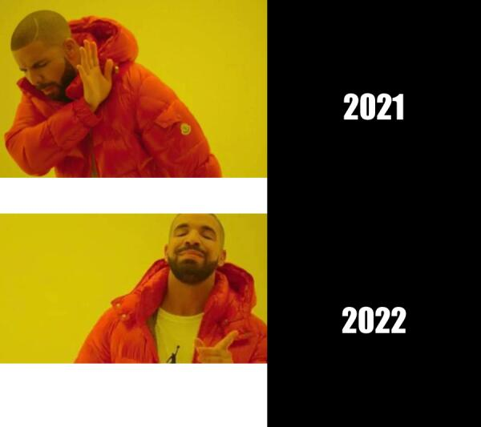

# Welcome!

Here I will describe how I created the new meme using the R code and information about the meme.

## About me

I'm a data science student at the University of Auckland taking the course [STATS 220](https://courseoutline.auckland.ac.nz/dco/course/STATS/220/1213). **I love music, coffee, and code.** 

## I also love memes!

Below is a meme I made using the R package [{magick}](https://cran.r-project.org/web/packages/magick/vignettes/intro.html).



A really short summary of my inspiration for the meme is:

1. The original image is taken from the music video of Drake's 2015 hit R&B single "Hotline Bling" typically to express one's disdain of the thread topic or something said by another poster.
   
2. Images of screenshots from Drake's music video 'Hotline Bling' are quickly spreading to various forums. Therefore I have used the screenshots to create this meme.

I also probably should provide the `R` code I used to make the meme!
```
library(magick)
# square one
meme_no <- image_read("https://img0.baidu.com/it/u=701614829,3131418648&fm=253&fmt=auto&app=138&f=JPEG?w=750&h=500") %>%
  image_scale(500)

#square two
text1 <- image_blank(width = 400, 
                          height = 400, 
                          color = "#000000") %>%
  image_annotate(text = "2021",
                 color = "#FFFFFF",
                 size = 60,
                 font = "Impact",
                 gravity = "center")

# square three
meme_yes <- image_read("https://img1.baidu.com/it/u=1136745990,1653486405&fm=253&fmt=auto&app=138&f=JPEG?w=480&h=270") %>%
  image_scale(500)

# square four
text2 <- image_blank(width = 400, 
                       height = 400, 
                       color = "#000000") %>%
  image_annotate(text = "2022",
                 color ="#FFFFFF",
                 size = 60,
                 font = "Impact",
                 gravity = "center")

# making each row

# first using the approach we used above
meme_vector <- c(meme_no, text1)
top_row <- image_append(meme_vector)

# second using a different approach
bottom_row <- image_append(c(meme_yes, text2))

# using another approach
meme <- c(top_row, bottom_row) %>%
  image_append(stack = TRUE) %>%
  image_scale(600)

image_write(meme, "my_meme.png")
```
